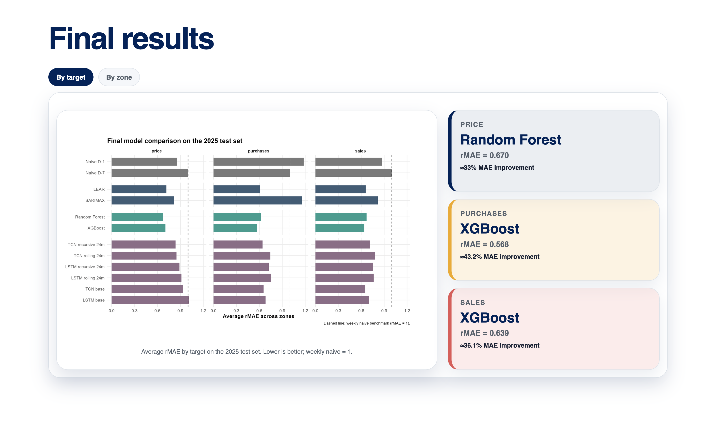

# Forecasting in the Italian day-ahead electricity market

A comparative study of statistical, machine learning and deep learning methods for day-ahead forecasting in the Italian electricity market.

The project forecasts hourly electricity **prices**, **accepted purchase volumes** and **accepted sale volumes** across the seven physical bidding zones of the Italian *Mercato del Giorno Prima*.

[View the interactive presentation](https://mariacolmon.github.io/Forecasting_Italian_day_ahead_electricity_market/) ·
[Read the Master's Thesis](docs/thesis.pdf)

[](https://mariacolmon.github.io/Forecasting_Italian_day_ahead_electricity_market/)

## Project overview

The study compares six forecasting approaches:

- SARIMAX
- LEAR
- Random Forest
- XGBoost
- LSTM
- Temporal Convolutional Network

Forecasts are evaluated on the 2025 test set using a common rolling forecasting framework across:

- 7 Italian bidding zones
- 3 forecasting targets
- 24 day-ahead hourly horizons

The main evaluation measure is the relative Mean Absolute Error (**rMAE**) against the weekly seasonal naive benchmark. Statistical significance is assessed using Diebold–Mariano tests.

## Key results

Random Forest achieved the best average performance for zonal electricity prices, with an rMAE of **0.670**.

XGBoost obtained the strongest results for purchase and sale volumes, with average rMAE values of **0.568** and **0.639**, respectively.

Overall, tree-based machine learning models outperformed the statistical benchmarks and the deep learning architectures. The results also show that additional model complexity does not automatically translate into greater forecasting accuracy.

## Data and methodology

The analysis uses hourly data from the Italian electricity market for the period 2021–2025.

The final dataset combines:

- zonal prices, purchases and sales;
- national and cross-zonal market variables;
- market concentration indicators;
- calendar information;
- zonal weather variables;
- lagged regional and national information.

The data were normalized to a regular 24-hour daily grid to handle daylight-saving-time transitions consistently.

Model development was performed using data before 2024, with:

- **2024:** model validation and specification selection;
- **2025:** final out-of-sample test evaluation.

## Repository structure

```text
.
├── final-results.png
├── docs/
│   ├── index.html
│   ├── thesis.pdf
│   └── presentation_files/
├── scripts/
│   ├── 01_data_ingestion.R
│   ├── 02_weather_extraction.R
│   ├── 03_evaluation_index.R
│   ├── 04_naive_benchmarks.R
│   ├── 05_evaluation_metrics.R
│   ├── 06_sarimax.R
│   ├── 07_lear_model.R
│   ├── 08_random_forest_multioutput.py
│   └── ...
└── README.md

```

The code is organised assuming the following local project structure:

```text
project_root/
  data/
    raw/
    processed/
    evaluation/
    predictions/
    metrics/
  scripts/
